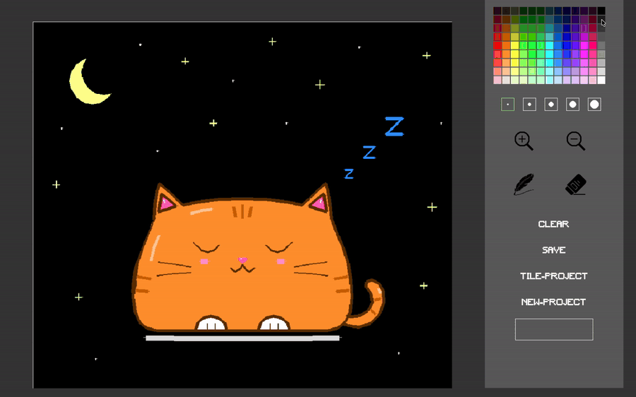
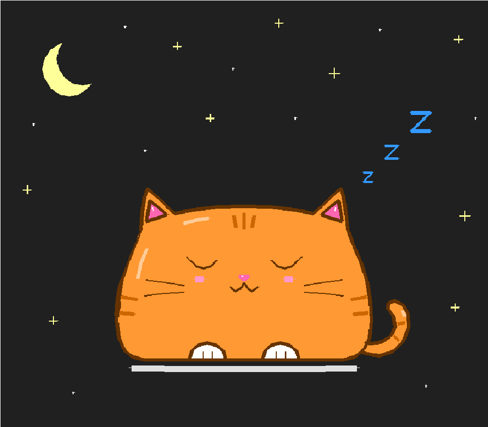
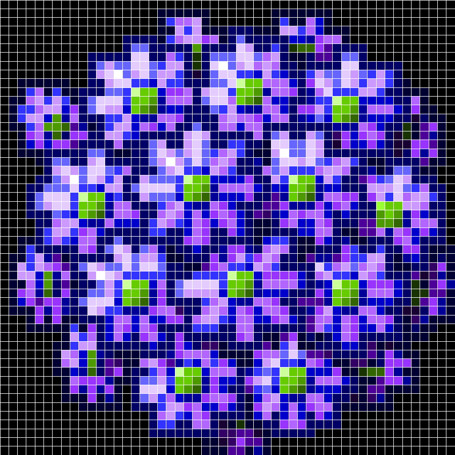
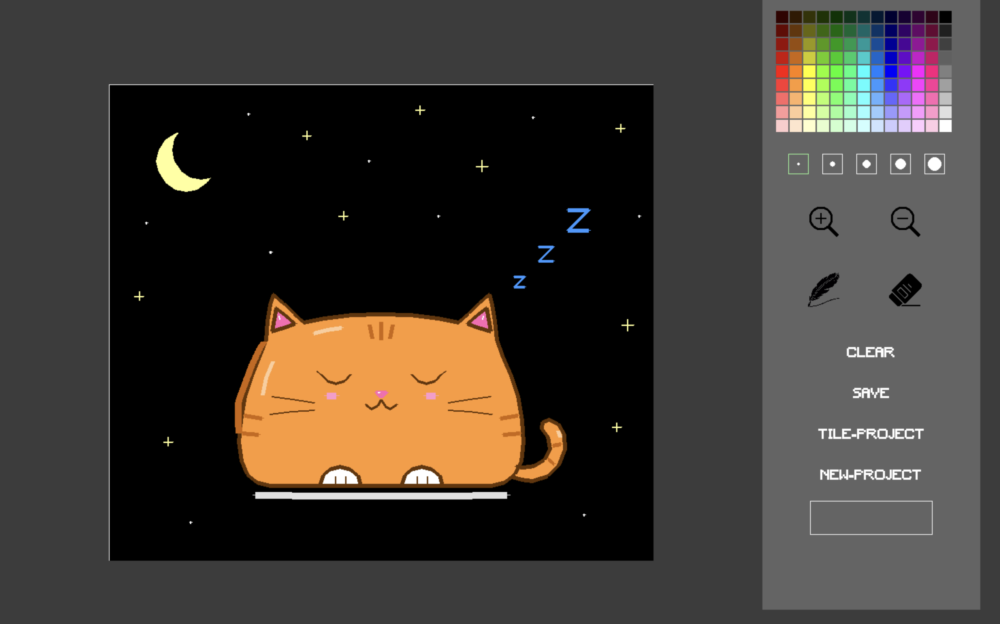

# Draw.py — Desktop Drawing App (Python + pygame)

> Originally written in 2024 as a high school self-study project. Uploaded to GitHub in 2026.



A desktop drawing application built from scratch with pygame, with two modes:

- **Freehand mode** — draw on a custom-sized canvas (up to 1120 × 900)
- **Pixel-grid mode** — color a grid tile by tile, like pixel art

| Freehand mode | Pixel-grid mode (52 × 52) |
|---|---|
|  |  |



## Features

- 117-color palette (9 × 13)
- 5 brush sizes, pen and eraser
- Right-click paint bucket (flood fill)
- Zoom in / out
- Save to PNG (custom filename, saved to your Desktop)
- Switch between freehand and pixel-grid projects without restarting

## Run it

```bash
pip install pygame
python Draw.py
```

Run it from the project folder — fonts and icons are loaded from `Asset/` by relative path.

## Controls

| Action | How |
|---|---|
| Draw | Hold left mouse button and drag on the canvas |
| Fill an area | Right-click inside it |
| Pick color / brush / pen / eraser / zoom | Click in the right-hand panel |
| Save | Type a filename in the panel, then click **SAVE** |
| Clear / new project | **CLEAR**, **NEW-PROJECT**, **TILE-PROJECT** / **DRAW-PROJECT** |

## How it works

- **State machine.** The main loop switches between four screens (main menu, freehand canvas, grid menu, grid canvas) using a state flag, with a second flag so each screen is initialized only once.
- **Continuous strokes.** The app samples the mouse once per frame (60 FPS), so drawing single points would leave gaps on fast strokes. Instead, each frame draws a line from the previous mouse position to the current one.
- **Flood fill.** The paint bucket uses an iterative, stack-based fill (DFS). Using a loop with an explicit stack instead of recursion avoids Python's recursion limit (~1000) on large areas.
- **Grid coloring reuses the same fill.** Grid lines are drawn in a unique color, `(1, 1, 1, 0)`, so they act as walls: filling from inside a cell stops at its borders, and one algorithm powers both the paint bucket and pixel-grid coloring.

## What I'd do differently

Looking back at this code two years later:

- **No button abstraction.** Every button is an `if` on raw coordinates, so adding one touches many places. A `Button` class and a list of buttons would fix that.
- **Global state.** The current screen is a global variable changed from many functions, which makes bugs hard to trace. Each screen should return the next state and let the main loop switch.
- **Duplicated code.** The freehand and grid modes have near-identical fill, menu, and save functions that could be shared.
- **Zoom rescales the canvas itself**, so zooming loses pixel data. Keeping the original image and storing only a zoom factor would avoid that.
- **Known bugs:** closing the window in freehand mode calls `pygame.quit()` without `sys.exit()`, grid coloring reads `event.pos` outside the event loop, which can crash if the last event was a key press, and only colors the cell under the last event of each frame, so fast drags skip cells. The right-click fill also reads `pygame.mouse.get_pos()` instead of the click's `event.pos`, so if the mouse moves before the event is handled, the fill lands in the wrong place.
